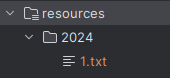

# Advent of Code - Java

To repozytorium zawiera moje rozwiązania do corocznego wyzwania **[Advent of Code](https://adventofcode.com/)**,
zrealizowane w języku Java.

## Uruchomienie

Do uruchomienia potrzebny jest plik z danymi wejściowymi umieszczony w folderze
[resources](src/main/resources) w katalogu dla konkretnego roku. Nazwa pliku powinna być w formacie numerDnia.txt

Żeby uruchomić całość:
> gradle run

W celu odpalenia konkretnego dnia:
> gradle run --args="2024-01b"

Można także uruchomić wszystkie dostępne zadania z konkretnego roku:
> gradle run --args="2023"

## Postępy 2024

| 2024    | A | B |
|---------|---|---|
| Dzień 1 | ✅ | ✅ |
| Dzień 2 | ✅ | ✅ |
| Dzień 3 | ✅ | ✅ |
| Dzień 4 | ✅ | ✅ |

## Ubiegłe lata w tym repozytorium

| rok  | rozwiązania |
|------|-------------|
| 2023 | 24*         |
| 2016 | 17*         |
| 2015 | 38*         |

## Pozostałe repozytoria

| rok  | repozytorium                           | język  |
|------|----------------------------------------|--------|
| 2022 | https://github.com/jezinka/advent_2022 | python |
| 2021 | https://github.com/jezinka/advent-2021 | groovy |

